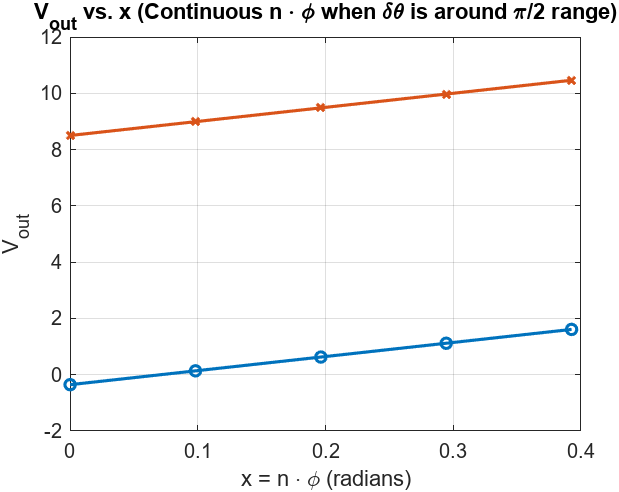

# THz Phase Discriminator: Analytical and Experimental Approach

## 📌 Overview
This project explores the design and analysis of a **THz Phase Discriminator** by deriving closed-form solutions for extracting unknown phase shifts from measured outputs. Using **small-angle approximations** and **simultaneous equation solving**, we compute **\( \delta\theta \)** and **\( A B k \)** from measured data, enabling an accurate phase extraction mechanism.

The analysis is implemented in **MATLAB**, where:
- **Closed-form solutions** are used to extract unknowns analytically.
- **Graphical analysis** is conducted to study how \( V_{\text{out}} \) varies with respect to phase shifts.
- **Continuous vs. discrete phase variation** is explored to understand sensitivity and error bounds.

---

## 🛠️ Methodology

### **1️⃣ Deriving the Phase Extraction Equation**
The output voltage is modeled as:

\[
V_n = -\frac{A B k}{2} (\delta\theta + n\phi - \frac{\pi}{2}) + DC
\]

where:
- **\( \delta\theta \)** is the unknown phase shift we aim to extract.
- **\( A B k \)** is a proportionality constant to be determined.
- **\( \phi \)** is the small phase increment.
- **\( DC \)** is the DC offset.
- **\( n \)** varies from **-3 to 3**, representing different measurements.

To find **\( \delta\theta \)** and **\( A B k \)**, we use:
1. **Three measured values** \( V_{-1}, V_0, V_1 \) to construct a solvable system.
2. **Closed-form equations** derived using small-angle approximations.

---

### **2️⃣ Closed-Form Solutions**
Using algebraic manipulations:

\[
A B k = -\frac{V_1 - V_{-1}}{\phi}
\]

\[
\delta\theta = 1 + \frac{2V_0}{A B k}
\]

\[
DC = V_0
\]

These solutions allow us to extract **\( \delta\theta \)** without iterative solvers.

---

### **3️⃣ Graphical Analysis**
Two approaches are visualized:
1. **Discrete \( n \) values (-3 to 3)**: Showing discrete behavior of \( V_{\text{out}} \).
2. **Continuous \( x = n\phi \) from 0 to \( 2\pi \)**: Providing a smooth visualization of how \( V_{\text{out}} \) varies with phase.

📌 **MATLAB Implementation:**
- **Extract \( \delta\theta \) and \( A B k \) using measured data.**
- **Compute \( V_{\text{out}} \) for discrete \( n \) values.**
- **Plot \( V_{\text{out}} \) against a continuous \( x = n\phi \) range.**

---
